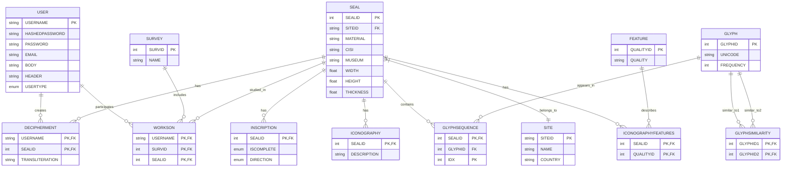

## ER diagram for indus-site database

```mermaid
erDiagram
    USER {
        string USERNAME PK
        string HASHEDPASSWORD
        string PASSWORD
        string EMAIL
        string BODY
        string HEADER
        enum USERTYPE
    }
    
    SEAL {
        int SEALID PK
        string SITEID FK
        string MATERIAL
        string CISI
        string MUSEUM
        float WIDTH
        float HEIGHT
        float THICKNESS
    }
    
    SITE {
        string SITEID PK
        string NAME
        string COUNTRY
    }
    
    INSCRIPTION {
        int SEALID PK,FK
        enum ISCOMPLETE
        enum DIRECTION
    }
    
    ICONOGRAPHY {
        int SEALID PK,FK
        string DESCRIPTION
    }
    
    FEATURE {
        int QUALITYID PK
        string QUALITY
    }
    
    GLYPH {
        int GLYPHID PK
        string UNICODE
        int FREQUENCY
    }
    
    SURVEY {
        int SURVID PK
        string NAME
    }
    
    DECIPHERMENT {
        string USERNAME PK,FK
        int SEALID PK,FK
        string TRANSLITERATION
    }
    
    GLYPHSEQUENCE {
        int SEALID PK,FK
        int GLYPHID FK
        int IDX PK
    }
    
    ICONOGRAPHYFEATURES {
        int SEALID PK,FK
        int QUALITYID PK,FK
    }
    
    GLYPHSIMILARITY {
        int GLYPHID1 PK,FK
        int GLYPHID2 PK,FK
    }
    
    WORKSON {
        string USERNAME PK,FK
        int SURVID PK,FK
        int SEALID PK,FK
    }

    SEAL ||--o{ INSCRIPTION : has
    SEAL ||--o{ ICONOGRAPHY : has
    SEAL ||--o{ GLYPHSEQUENCE : contains
    SEAL }|--|| SITE : belongs_to
    USER ||--o{ DECIPHERMENT : creates
    SEAL ||--o{ DECIPHERMENT : has
    SEAL ||--o{ ICONOGRAPHYFEATURES : has
    FEATURE ||--o{ ICONOGRAPHYFEATURES : describes
    GLYPH ||--o{ GLYPHSEQUENCE : appears_in
    GLYPH ||--o{ GLYPHSIMILARITY : similar_to1
    GLYPH ||--o{ GLYPHSIMILARITY : similar_to2
    USER ||--o{ WORKSON : participates
    SURVEY ||--o{ WORKSON : includes
    SEAL ||--o{ WORKSON : studied_in
```
